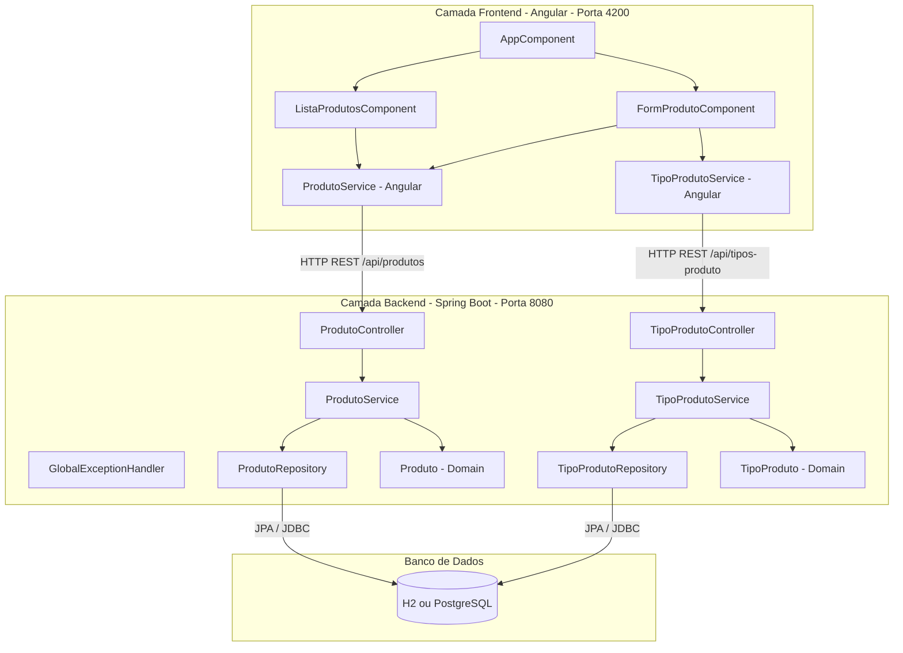
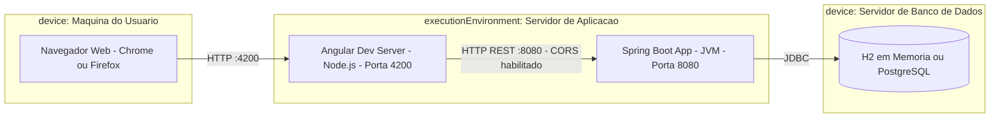

# Material Didatico - Migracao de Projeto Java Console para Web com Spring Boot e Angular

## 1. Apresentacao do Trabalho

Este material foi criado para turmas iniciantes, sem experiencia previa com Spring Boot ou Angular.
A proposta e migrar um CRUD Java baseado em camadas para uma arquitetura web moderna, mantendo foco em boas praticas e padroes de projeto.

## 2. Objetivos de Aprendizagem

Ao final do trabalho, o aluno deve ser capaz de:

1. Explicar a diferenca entre aplicacao console e aplicacao web.
2. Organizar backend em camadas: Controller, Service, Repository, Domain.
3. Criar API REST com operacoes CRUD.
4. Aplicar validacoes e tratamento de erros.
5. Construir frontend Angular consumindo API REST.
6. Relacionar implementacao com padroes de projeto estudados.

## 3. Publico-Alvo e Pre-requisitos

Publico-alvo:

- Alunos com base em Java orientado a objetos.

Pre-requisitos minimos:

- Java 17 ou superior.
- Maven.
- Node.js LTS.
- Angular CLI.
- VS Code.
- Git (opcional, recomendado).

## 4. Resultado Esperado

Ao fim do percurso, cada grupo deve entregar:

1. Backend Spring Boot funcional com API REST de produtos e tipos de produto.
2. Frontend Angular funcional com telas de listagem e cadastro.
3. Integracao entre frontend e backend.
4. Documento curto explicando os padroes aplicados.

## 5. Arquitetura do Sistema - Diagramas UML

Os diagramas a seguir representam a arquitetura do sistema completo apos a migracao, auxiliando na compreensao das responsabilidades de cada componente e de como o sistema e implantado.

### 5.1 Diagrama de Componentes

Exibe os principais componentes do sistema, suas interfaces e dependencias.

### 5.2 Diagrama de Implantacao

Exibe os nos fisicos onde os artefatos do sistema sao instalados e executados.

> **Nota de producao:** Ao executar `ng build`, o Angular gera arquivos estaticos que podem ser servidos diretamente pelo Spring Boot, eliminando a necessidade de um servidor Node.js separado em ambiente de producao.

## 6. Cronograma Sugerido (6 encontros)

### Encontro 1 - Ambiente e Visao Geral

Objetivo:

- Preparar ambiente e compreender arquitetura do projeto atual.

Atividades:

1. Verificar instalacao de Java, Maven, Node e Angular CLI.
2. Executar o projeto atual e discutir organizacao de pacotes.
3. Mapear as responsabilidades das classes principais.

Checklist:

- Ambiente configurado em todos os computadores.
- Registro de como o projeto atual esta organizado.

Erros comuns:

- Versao de Java incompativel.
- Angular CLI nao instalado globalmente.

### Encontro 2 - Primeiro Backend com Spring Boot

Objetivo:

- Criar backend web minimo e separar camadas.

Atividades:

1. Criar projeto Spring Boot com dependencias:
   - Spring Web
   - Spring Data JPA
   - Validation
   - H2 Database
2. Criar estrutura de pacotes:
   - domain
   - repository
   - service
   - controller
   - dto
   - exception
3. Criar entidade TipoProduto e Produto.
4. Criar endpoint inicial de teste.

Checklist:

- Aplicacao sobe sem erros.
- Endpoint de teste responde.
- Estrutura de camadas criada.

Erros comuns:

- Falta de anotacoes de entidade.
- Erro de porta em uso.

### Encontro 3 - CRUD REST e Validacoes

Objetivo:

- Implementar CRUD no backend e validar dados.

Atividades:

1. Criar repositories com JpaRepository.
2. Implementar services com regras de negocio.
3. Criar controllers REST para produtos e tipos.
4. Criar DTOs de entrada e saida.
5. Aplicar validacoes com anotacoes de bean validation.

Checklist:

- GET lista dados.
- POST cria dados validos.
- DELETE remove por id.
- Validacoes retornam erros compreensiveis.

Erros comuns:

- Expor entidade diretamente no retorno.
- Regra de negocio implementada no controller.

### Encontro 4 - Tratamento Global de Erros

Objetivo:

- Padronizar respostas de erro da API.

Atividades:

1. Criar excecao de negocio.
2. Criar handler global com ControllerAdvice.
3. Padronizar payload de erro (status, mensagem, data, caminho).
4. Testar cenarios de erro.

Checklist:

- Erros de validacao retornam 400.
- Regras de negocio retornam mensagem clara.
- API possui formato de erro padrao.

Erros comuns:

- Capturar Exception generica sem criterio.
- Respostas diferentes para erros parecidos.

### Encontro 5 - Frontend Angular e Integracao

Objetivo:

- Construir frontend inicial e integrar com API.

Atividades:

1. Criar projeto Angular.
2. Criar componentes:
   - lista-produtos
   - form-produto
3. Criar service Angular para chamadas HTTP.
4. Implementar listagem e cadastro.
5. Ligar frontend ao backend com tratamento basico de erro.

Checklist:

- Tela lista produtos da API.
- Formulario cadastra novo produto.
- Mensagens de sucesso e erro aparecem na tela.

Erros comuns:

- URL de API incorreta.
- Falta de importacao do HttpClientModule.

### Encontro 6 - Consolidacao, Padroes e Apresentacao

Objetivo:

- Consolidar aprendizado e explicitar padroes de projeto usados.

Atividades:

1. Revisar separacao de responsabilidades por camada.
2. Relacionar codigo com padroes estudados.
3. Preparar demonstracao curta.
4. Entregar documentacao final.

Checklist:

- Sistema funcionando ponta a ponta.
- Explicacao dos padroes aplicada ao codigo real.
- Entrega com orientacoes de execucao.

Erros comuns:

- Projeto roda apenas na maquina de quem desenvolveu.
- Falta de descricao clara no README.

## 7. Passo a Passo Tecnico para os Alunos

### Etapa A - Criar Backend Spring Boot

1. Acessar Spring Initializr.
2. Definir projeto Maven com Java 17.
3. Adicionar dependencias Web, JPA, Validation e H2.
4. Baixar e abrir no VS Code.
5. Rodar aplicacao para validar ambiente.

### Etapa B - Modelagem e Persistencia

1. Criar entidades Produto e TipoProduto.
2. Criar relacionamento entre as entidades.
3. Criar repositories com JpaRepository.
4. Configurar H2 no arquivo de propriedades.

### Etapa C - Service e Controller

1. Implementar regras de negocio no service.
2. Criar DTOs para request/response.
3. Criar endpoints REST para CRUD.
4. Testar com Insomnia ou Postman.

### Etapa D - Tratamento de Erros

1. Criar classe de excecao de negocio.
2. Criar classe com ControllerAdvice.
3. Padronizar estrutura JSON de erro.

### Etapa E - Criar Frontend Angular

1. Criar projeto Angular com Angular CLI.
2. Criar componentes de lista e formulario.
3. Criar service para consumir API.
4. Implementar listagem e cadastro.

### Etapa F - Integracao Final

1. Validar CORS no backend.
2. Testar fluxo completo:
   - cadastrar no Angular
   - listar no Angular
   - remover no Angular
3. Corrigir erros de validacao exibidos na interface.

## 8. Padroes de Projeto que Devem Aparecer

No backend:

1. MVC (organizacao controller-service-repository).
2. Repository (acesso a dados).
3. Service Layer (regras de negocio).
4. DTO (contratos de entrada/saida).

No frontend:

1. Observer (fluxo assincrono com RxJS).
2. Facade simples via service de dominio (opcional para turmas iniciantes).

## 9. Rubrica de Avaliacao (100 pontos)

1. Funcionamento do CRUD completo (backend + frontend): 35 pontos.
2. Organizacao em camadas e separacao de responsabilidades: 20 pontos.
3. Validacoes e tratamento padrao de erros: 15 pontos.
4. Aplicacao correta de padroes de projeto: 15 pontos.
5. Qualidade da documentacao e apresentacao final: 15 pontos.

## 10. Modelo de Entrega

Cada grupo deve entregar:

1. Codigo-fonte completo.
2. README com:
   - requisitos
   - como executar backend
   - como executar frontend
   - principais endpoints
3. Relatorio curto (1 a 2 paginas) contendo:
   - padroes aplicados
   - dificuldades encontradas
   - melhorias futuras

## 11. Perguntas Guia para Apresentacao dos Alunos

1. Onde fica a regra de negocio no sistema de voces?
2. Qual foi a principal mudanca ao migrar de console para web?
3. Como o frontend conversa com o backend?
4. Como voces tratam erros de validacao?
5. Qual padrao de projeto trouxe maior ganho e por que?

## 12. Roteiro de Correcao Rapida para o Professor

1. O projeto sobe com um comando claro?
2. O backend responde endpoints essenciais?
3. O frontend realiza operacoes basicas sem quebra?
4. Existe padrao minimo de organizacao arquitetural?
5. O grupo consegue explicar as decisoes tomadas?

## 13. Extensoes Opcionais (Para Turmas Mais Avancadas)

1. Substituir H2 por PostgreSQL.
2. Implementar atualizacao (PUT) com validacoes.
3. Adicionar filtros de busca.
4. Criar testes unitarios no backend.
5. Criar interceptor Angular para erros globais.

## 14. Conclusao

Este tutorial foi planejado para iniciantes e prioriza evolucao incremental. A cada encontro, o aluno aprende um bloco pequeno e funcional, reduzindo a complexidade da migracao.
O foco nao e apenas ter um sistema pronto, mas entender por que a arquitetura web com Spring e Angular melhora organizacao, manutencao e escalabilidade.
